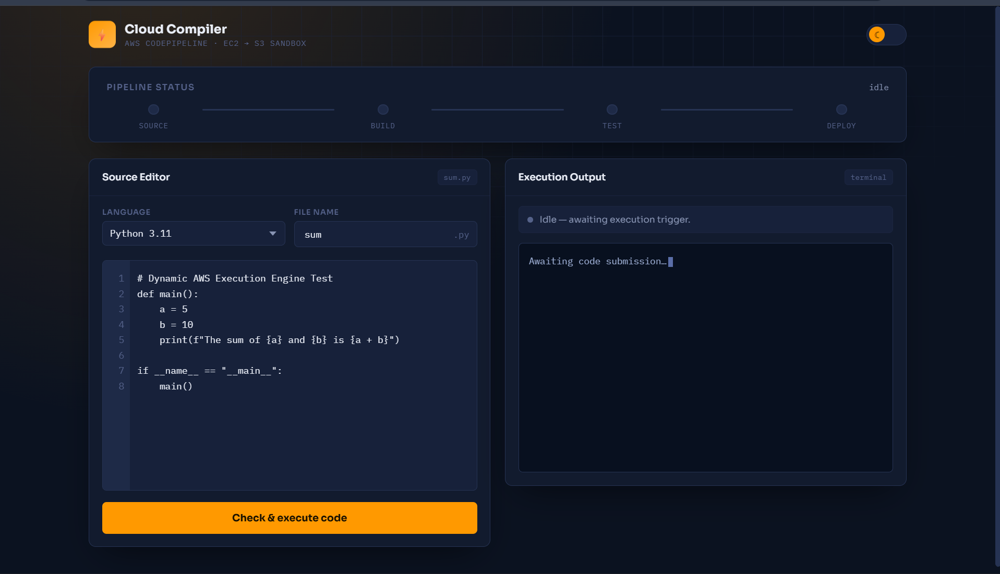
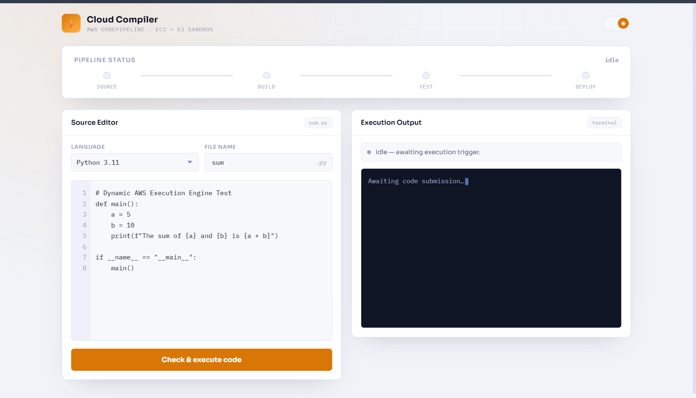
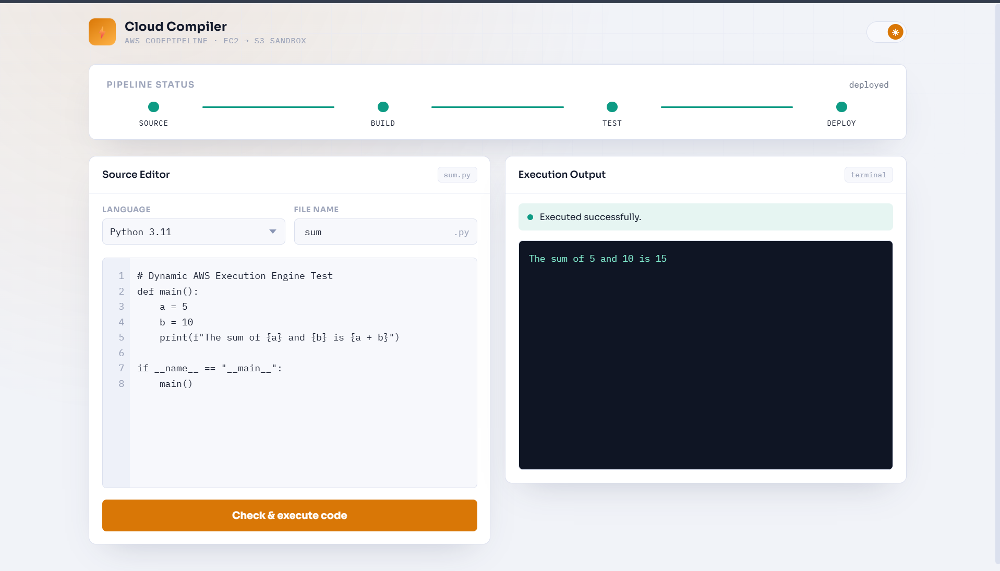
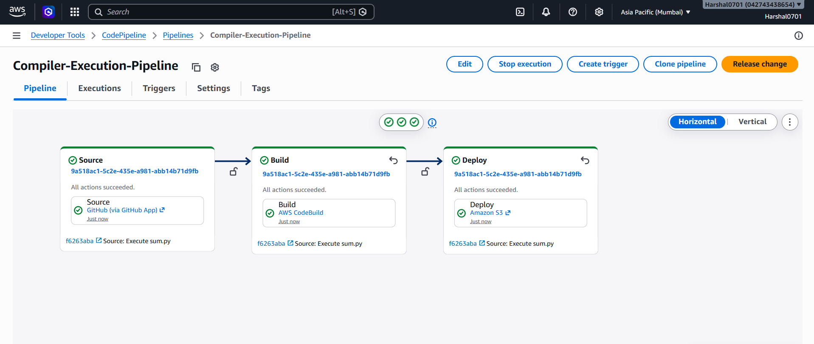

# 🚀 Cloud-Based Online Code Compiler

<p align="center">
  
</p>

<p align="center">

[](http://15.206.149.86/)


</p>

---

# 🌐 Live Demo

## 🚀 Production Application

**Live URL**

http://15.206.149.86/

> The application is deployed on an **Amazon EC2** instance with the backend managed by **PM2**, while **Amazon S3**, **AWS CodeBuild**, and **AWS CodePipeline** handle cloud-based code execution and automated deployment.

---

# 📖 Overview

The **Cloud-Based Online Code Compiler** is a production-inspired cloud application that enables users to write, compile, and execute **Java** and **Python** programs directly from a web browser.

Unlike traditional online compilers that execute code on a local server, this project leverages **Amazon Web Services (AWS)** to securely process code execution in an isolated cloud environment.

When users submit code, the application uploads it to **Amazon S3**, triggers **AWS CodeBuild** to compile and execute the program, and returns the output to the frontend. The deployment pipeline is fully automated using **AWS CodePipeline** integrated with **GitHub**. The application is continuously hosted on an **Amazon EC2** instance with the backend managed by **PM2**.

This architecture demonstrates cloud-native application development, CI/CD automation, scalable backend processing, and secure code execution.

---

# 🏆 Project Highlights

- 🌐 Live production deployment on Amazon EC2
- ☁️ Cloud-native code execution using AWS CodeBuild
- 📂 Source code stored securely in Amazon S3
- 🔄 Automated CI/CD with AWS CodePipeline
- 🚀 Continuous backend hosting using PM2
- 💻 REST API backend using Express.js
- ⚡ Supports Java and Python code execution
- 🔒 Secure AWS IAM integration
- 📈 Production-inspired cloud architecture
- 📱 Responsive web interface

---

# ✨ Features

- 💻 Online Java Compiler
- 🐍 Online Python Compiler
- ⚡ Real-time Code Execution
- 📤 Upload User Code to Amazon S3
- ☁️ Compile & Execute using AWS CodeBuild
- 🔄 Automatic Deployment using AWS CodePipeline
- 📂 GitHub Integration
- 🌐 REST API Backend using Express.js
- 📋 Live Execution Output
- ⚙️ Production-inspired Cloud Architecture
- 📱 Responsive User Interface
- 🚀 Fast Execution Workflow

---

# ☁️ AWS Services Used

| Service | Purpose |
|----------|----------|
| Amazon S3 | Stores user source code |
| AWS CodeBuild | Compiles and executes code |
| AWS CodePipeline | Automates deployment |
| IAM | Secure AWS permissions |
| CloudWatch | Build logs and monitoring |
| Amazon EC2 | Hosts the application |
| PM2 | Keeps the backend running continuously |

---

# 🛠 Tech Stack

## Frontend

- HTML5
- CSS3
- JavaScript

## Backend

- Node.js
- Express.js

## Cloud

- Amazon S3
- AWS CodeBuild
- AWS CodePipeline
- Amazon EC2
- IAM
- CloudWatch
- PM2

---

# 🏗️ System Architecture

```text
                    +----------------------+
                    |      Web Browser     |
                    +----------+-----------+
                               |
                               ▼
                     Express.js Backend
                               |
                               ▼
                     Upload Source Code
                               |
                               ▼
                         Amazon S3 Bucket
                               |
                               ▼
                     AWS CodeBuild Project
                               |
                     Compile & Execute Code
                               |
                               ▼
                        Build Artifacts
                               |
                               ▼
                    Execution Output
                               |
                               ▼
                          Web Browser
```

---

# 🔄 Deployment Pipeline

```text
Developer
     │
     ▼
GitHub Repository
     │
     ▼
AWS CodePipeline
     │
     ▼
AWS CodeBuild
     │
     ▼
Amazon EC2 (PM2)
     │
     ▼
Live Application
```

---

# ⚙️ How It Works

### Step 1

User writes Java or Python code.

⬇️

### Step 2

Frontend sends the code to the Express backend.

⬇️

### Step 3

Backend uploads the source file to Amazon S3.

⬇️

### Step 4

AWS CodeBuild downloads the source code.

⬇️

### Step 5

The build environment compiles and executes the code.

⬇️

### Step 6

Execution output is generated.

⬇️

### Step 7

The backend retrieves the output and displays it to the user.

---

# 📂 Project Structure

```text
user-code-runner/
│
├── public/
│   └── index.html
│
├── screenshots/
│   ├── home.png
│   ├── code-editor.png
│   ├── output.png
│   └── codepipeline.png
│
├── server.js
├── pipeline-monitor.js
├── buildspec.yml
├── package.json
├── package-lock.json
├── README.md
└── .gitignore
```

---

# 📸 Screenshots

## 🏠 Home Page


---

## 💻 Code Editor



---

## 📄 Output



---

## 🔄 AWS CodePipeline



---

# 🚀 Installation

Clone the repository:

```bash
git clone https://github.com/harshal0701-art/user-code-runner.git
```

Navigate to the project:

```bash
cd user-code-runner
```

Install dependencies:

```bash
npm install
```

Start the server:

```bash
npm start
```

Or run using PM2:

```bash
pm2 start server.js --name code-compiler
```

Open your browser:

```
http://localhost:3000
```

---

# ☁️ Deployment

The application is deployed using the following AWS infrastructure:

- Amazon EC2 – Hosts the application
- PM2 – Keeps the Node.js backend running continuously
- Amazon S3 – Stores uploaded source code
- AWS CodeBuild – Compiles and executes Java/Python programs
- AWS CodePipeline – Automates deployment from GitHub
- CloudWatch – Build logs and monitoring
- IAM – Secure access management

## Production URL

http://15.206.149.86/

---

# 🔐 Security

- IAM Role-based Access Control
- Isolated Code Execution using AWS CodeBuild
- Source Code Stored Securely in Amazon S3
- No Persistent Code Storage on the Web Server
- Build Logs Managed with CloudWatch

---

# 📈 Scalability

The architecture is designed to scale by leveraging managed AWS services:

- Independent build environments
- Automated deployment pipeline
- Object storage with Amazon S3
- Cloud-native execution workflow
- Easily extendable to support additional programming languages

---

# 💡 Challenges Solved

- Secure remote code execution
- Cloud-based compilation workflow
- Automated deployment with CodePipeline
- Integration between S3, CodeBuild, and Node.js
- Multi-language support for Java and Python
- Production-style deployment pipeline

---

# 📚 Key Learning Outcomes

- Cloud Application Development
- REST API Development
- CI/CD Pipeline Design
- AWS CodeBuild Integration
- Amazon S3 Storage Management
- Automated Deployment
- Express.js Backend Development
- Cloud Security with IAM
- Production Deployment on Amazon EC2
- Process Management with PM2

---

# 🔮 Future Enhancements

- C/C++ Support
- JavaScript Execution
- Docker-based Sandboxed Execution
- User Authentication
- Code History
- Multiple Themes
- Compiler Optimization Levels
- AI Code Suggestions
- Execution Time Analytics

---

# 👨‍💻 Author

## Harshal Chaudhari

**Computer Engineer**

Backend Developer | AWS Cloud Enthusiast

### Connect

- GitHub: https://github.com/harshal0701-art
- LinkedIn: *(Add your LinkedIn profile here)*

---

# ⭐ Support

If you found this project helpful:

⭐ Star the repository

🍴 Fork the repository

📢 Share it with others

---

# 📄 License

This project is licensed under the MIT License.

---

# 💼 Portfolio Recommendation

For a more professional deployment, consider using:

- An AWS Elastic IP for a permanent public address
- A custom domain such as **compiler.harshalcloud.dev**
- HTTPS using an SSL certificate (Let's Encrypt or AWS Certificate Manager)
- Nginx as a reverse proxy in front of the Node.js application

These enhancements improve reliability, security, and create a more polished portfolio project for recruiters and clients.

---

<p align="center">
Made with ❤️ by Harshal Chaudhari
</p>